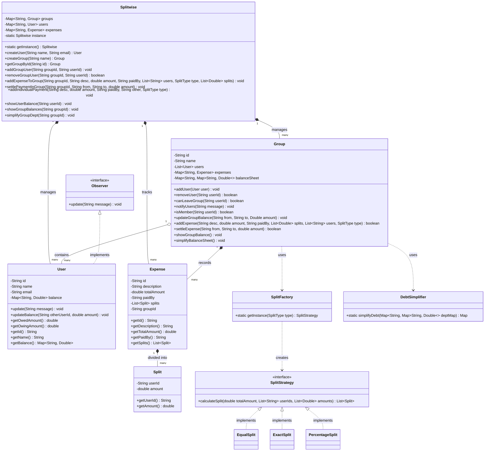

# Splitwise - Low Level Design (LLD)

A robust and scalable implementation of a Splitwise-like expense sharing application. This project demonstrates modern software engineering principles, design patterns, and an efficient debt simplification algorithm.

## 🚀 Features

- **User Management**: Create and manage users with unique identities.
- **Group Management**: Create groups and add/remove members.
- **Expense Tracking**: Add expenses within groups or between individuals.
- **Multiple Split Strategies**:
  - **Equal**: Split costs evenly among participants.
  - **Exact**: Specify exact amounts for each person.
  - **Percentage**: Split based on defined percentages.
- **Debt Simplification**: An advanced algorithm to minimize the total number of transactions required to settle all debts within a group.
- **Real-time Notifications**: Observer pattern implementation to notify users of new expenses and settlements.
- **Balance Sheets**: Detailed tracking of who owes whom, both at a group level and an individual level.

## 🏗️ Architecture & Design Patterns

The project follows clean code principles and utilizes several design patterns:

### 1. Singleton Pattern
Used in `Splitwise.java` to ensure a single orchestrator manages the entire state of the application.

### 2. Strategy Pattern
Used for calculating splits. The `SplitStrategy` interface defines the contract, implemented by `EqualSplit`, `ExactSplit`, and `PercentageSplit`. This allows for easy extension of new splitting logic without modifying core code.

### 3. Factory Pattern
Implemented in `SplitFactory.java` to decouple the creation of splitting strategies from their usage.

### 4. Observer Pattern
The `User` class implements the `Observer` interface, allowing groups to notify members whenever an expense is added or a payment is settled.

---

## 📊 Detailed Class Diagram (Mermaid UML)



---

## 🧠 Debt Simplification Algorithm

The project implements a **Min-Cash-Flow** algorithm. It calculates the net balance for every user (Total Owed - Total Owing). Users are then categorized into:
1. **Creditors**: People who are owed money.
2. **Debtors**: People who owe money.

The algorithm iteratively matches the largest debtor with the largest creditor, reducing the number of total transactions needed to reach a zero-balance state.

---

## 💻 Tech Stack

- **Language**: Java 21
- **Design Concepts**: OOP, SOLID Principles, Design Patterns.
- **Build**: Manual Compilation / Standard JDT.

## 📝 Usage Example

```java
Splitwise manager = Splitwise.getInstance();

// 1. Create Users
User user1 = manager.createUser("Aditya", "aditya@gmail.com");
User user2 = manager.createUser("Rohit", "rohit@gmail.com");

// 2. Create Group
Group group = manager.createGroup("Roommates");
manager.addGroupUser(group.getId(), user1.getId());
manager.addGroupUser(group.getId(), user2.getId());

// 3. Add Expense
manager.addExpenseToGroup(group.getId(), "Groceries", 1000.0, user1.getId(), Arrays.asList(user1.getId(), user2.getId()), SplitType.EQUAL);

// 4. Simplify Debts
manager.simplifyGroupDept(group.getId());
```

## 📄 License
This project is licensed under the MIT License.
